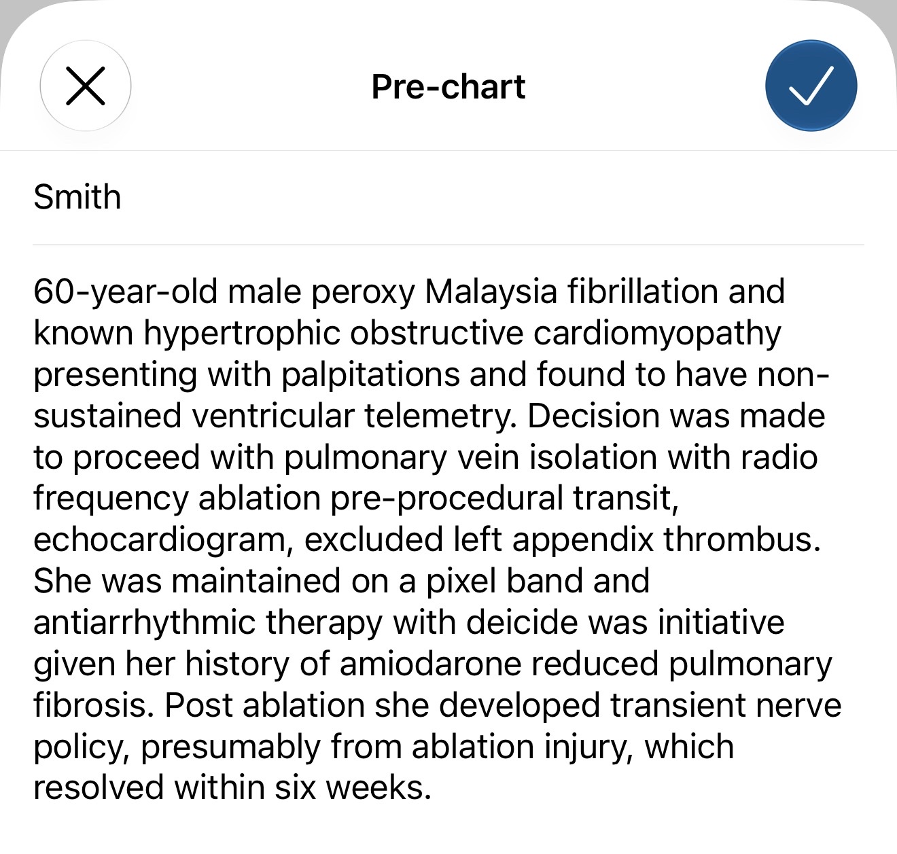
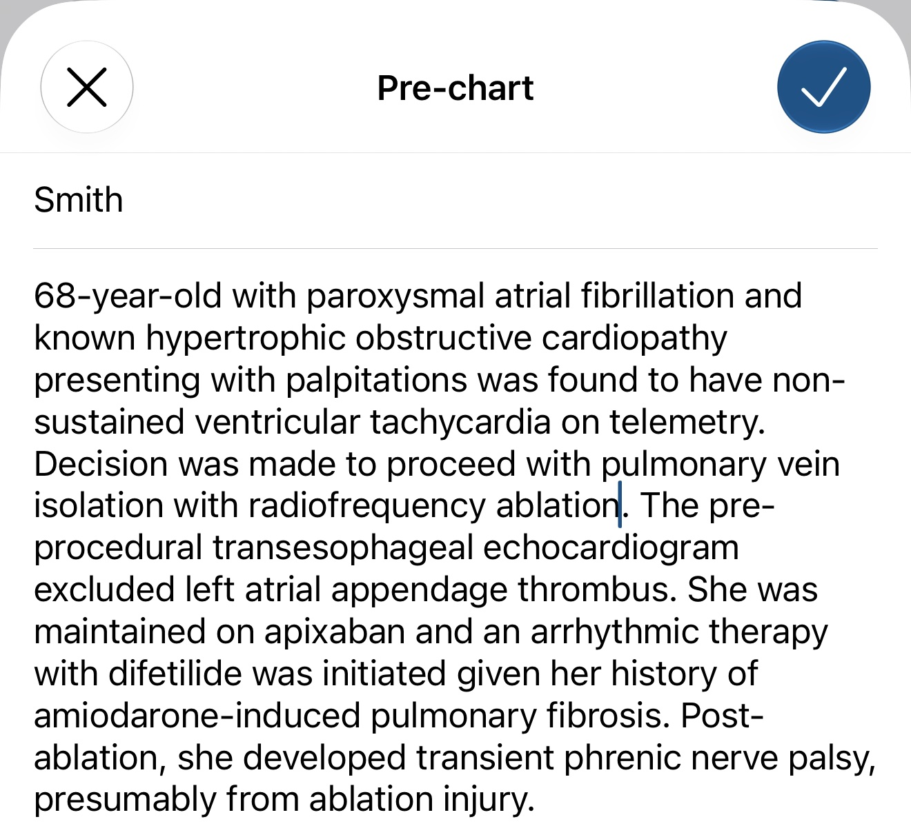

I use [Doximity Scribe for patient encounters](/blog/posts/doximity.html), and more recently for [precharting](/blog/posts/doximity_precharting.html): I read the chart in whatever order I find things and let a template impose the structure. The template works. Getting the words into Doximity in the first place was the part that kept failing.

I dictate because thumb-typing a chart summary on a phone takes minutes I do not have, and the voice-to-text built into iOS cannot spell cardiology.

## The Same Dictation, Twice

I made up a patient and read the same summary into Doximity's pre-chart field twice: once with the iOS keyboard microphone, once with Whisper Large v3 Turbo running on the phone.

<figure class="figure-pair">

<figure>
iOS dictation

</figure>
<figure>
Whisper, on-device

</figure>

<figcaption class="figure-caption">The same fictional case read aloud into Doximity's pre-chart field. iOS dictation (left) turned paroxysmal atrial fibrillation into "peroxy Malaysia fibrillation," apixaban into "a pixel band," dofetilide into "deicide," and phrenic nerve palsy into "nerve policy." Whisper (right) got every one of those right and made three smaller errors of its own.</figcaption>
</figure>

What each one heard:

| I said | iOS | Whisper |
|---|---|---|
| 68-year-old with | 60-year-old male | 68-year-old with |
| paroxysmal atrial fibrillation | peroxy Malaysia fibrillation | paroxysmal atrial fibrillation |
| non-sustained ventricular tachycardia on telemetry | non-sustained ventricular telemetry | non-sustained ventricular tachycardia on telemetry |
| transesophageal echocardiogram | transit, echocardiogram | transesophageal echocardiogram |
| left atrial appendage | left appendix | left atrial appendage |
| apixaban | a pixel band | apixaban |
| dofetilide | deicide | difetilide |
| was initiated | was initiative | was initiated |
| amiodarone-induced | amiodarone reduced | amiodarone-induced |
| phrenic nerve palsy | nerve policy | phrenic nerve palsy |
| cardiomyopathy | cardiomyopathy | cardiopathy |
| antiarrhythmic | antiarrhythmic | an arrhythmic |

iOS got the patient's age wrong, gave her the wrong sex, lost the arrhythmia, lost the anticoagulant, lost the antiarrhythmic, and turned a procedural complication into an insurance term. Whisper made three errors, and a reader could fix each one without the chart.

## Why Doximity Scribe Cannot Fix It Downstream

My first assumption was that the language model would clean up transcription errors. It knows cardiology. It should know I meant apixaban.

It cannot, and I would not want it to try. A model might recover "peroxy Malaysia fibrillation." "A pixel band" could be anything. "Deicide" gives the model nothing to reason from. "Nerve policy" dropped the word *phrenic*, and no amount of context puts it back. The model either drops the finding or guesses, and I wrote my template to stop it from guessing.

"60-year-old male" worries me most, because it reads as correct. That clean, plausible demographic line drops the patient's CHA2DS2-VASc score by two points, one for age and one for sex, and I would have no reason to question it. Feed the template a wrong transcript and it will organize the wrong facts into a tidy note.

## Why Whisper Does Better

iOS dictation behaves like a system tuned for everyday speech: messages, emails, search queries. When it hears a word it does not know, it reaches for the nearest common phrase, and "a pixel band" is a more common phrase than apixaban.

OpenAI trained Whisper on millions of hours of audio from the web, and it transcribes in chunks of up to 30 seconds instead of word by word as you speak. By the time it decodes "apixaban," it has heard "maintained on" before it and "antiarrhythmic therapy" after it. I suspect that surrounding context explains most of the gain on medical terms.

OpenAI released [Large v3 Turbo](https://huggingface.co/openai/whisper-large-v3-turbo) in October 2024 as a slimmed version of Whisper's largest model. It keeps the full encoder and cuts the decoder from 32 layers to 4, taking the model from 1.55 billion parameters to 809 million. That trade of a little accuracy for a lot of speed makes it usable on a phone.

## The Setup

I run it through [Spokenly](https://spokenly.app), which installs as an iOS keyboard. Anywhere I can type, including Doximity, I switch to the Spokenly keyboard, tap to record, read, and tap to stop. The transcript takes 3 to 4 seconds to appear and drops into the text field.

Spokenly offers both local and cloud models. I use the local, quantized Whisper Large v3 Turbo, so the audio is transcribed on the phone and never goes to a transcription server. Doximity still receives the text, as it would anything I typed, but no third party ever holds a recording of me reading a chart. The local models cost nothing.

## What It Still Gets Wrong

Whisper made three mistakes in this sample:

- **Cardiopathy** for cardiomyopathy. I can read it, and I still have to fix it.
- **An arrhythmic** for antiarrhythmic. It split the word and flipped the meaning. A careless reader could take "an arrhythmic therapy" at face value.
- **Difetilide** for dofetilide. The note generator may correct a near miss like this. I would not count on it.

I catch errors like these on a reread, so I read every transcript before I tap the checkmark. The iOS errors sent me back to the chart, because "nerve policy" gave me no way to reconstruct what I said.

## Bottom Line

The [precharting template](/blog/posts/doximity_precharting.html) handles the organizing, and local Whisper handles the input. Voice remains the fastest way I have found to get a chart into Doximity Scribe, as long as I keep Apple's dictation out of the loop.

Check your organization's policy on AI-assisted documentation and third-party keyboards before using any of this with real patient data.
