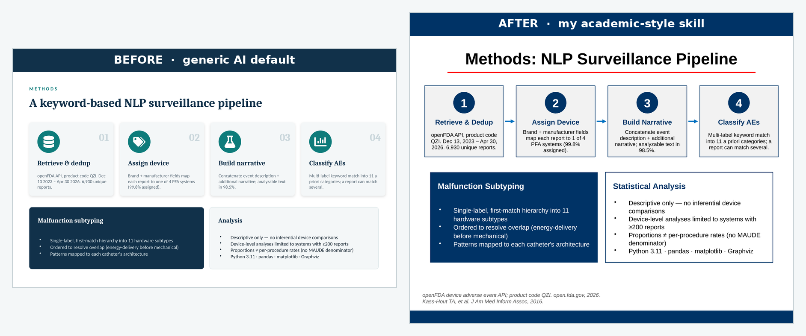
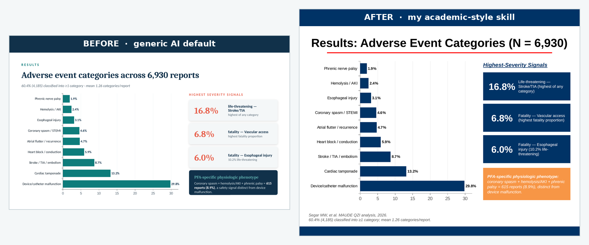

If you've sat through a conference session lately, you've seen these slides. Rounded cards, each one a slightly different shade of teal, a bold icon tucked inside a colored circle in the top-left of every card, a soft drop shadow under everything, a serif headline over a sans-serif body. They look clean and competent, and they're what you get when you ask an AI for a deck with no further instruction than "make me one."

That look isn't bad, it's generic. It signals "an LLM made this" the way a stock-photo handshake signals "a committee made this." For a research talk, where the point is that the work is yours, slides that look like everyone else's are a small but real tell.

So I fixed it the way I fix most things lately: I asked Claude to learn my style and hand it back as a tool I could reuse. I built a [skill](https://docs.claude.com/en/docs/agents-and-tools/agent-skills/overview) from one of my old decks, then tested whether it changes what Claude produces.

## The Generic Look, and Why It Happens

Ask any frontier model to build a slide deck and it reaches for the same vocabulary, because that vocabulary is good design advice in the abstract. Pick a bold color palette. Use one color for 60–70% of the visual weight. Commit to a repeated motif — icons in circles, rounded image frames. Avoid plain bullets on white. Every one of those rules is defensible. The problem is that *everyone's* model follows the same rules, so the output converges. The teal-card-with-icon deck is what you get when good generic taste runs with no constraints from you.

My conference slides don't look like that, because they're shaped by institutional constraints instead. They're 4:3, not widescreen, because the template predates the widescreen default and I never changed it. Every content slide has a centered title with a red rule underneath. There's a navy footer bar across the bottom of every slide. Stat callouts are navy boxes with a big number and a small label. Citations sit bottom-left in small italic, "Author, Journal, Year." None of it is fashionable, but it's mine, and an audience that's seen my talks recognizes it.

The interesting question: can I get those constraints out of my head and into a form Claude will apply automatically?

## Turning a Deck Into a Skill

A [skill](https://docs.claude.com/en/docs/agents-and-tools/agent-skills/overview) is just a folder Claude reads before it does a task: a `SKILL.md` file describing when and how to do something, optionally with reference assets alongside it. The leverage comes from writing the instructions down once and having them apply every time.
I gave Claude one of my real talks and asked it to reverse-engineer the design system into a skill, not to summarize the deck, but to extract the *rules* that would let it reproduce the look on new content. The output was a `SKILL.md` that reads like a style guide written by someone who'd stared at my slides for an hour:

- **Format.** 4:3 (10″ × 7.5″), white background on every slide. An explicit note *not* to default to widescreen.
- **Palette.** A table of seven roles mapped to exact hex values. Navy `003366` dominates; red `FF0000` for the title rule and adverse arrows; `C00000` for emphasis; orange `F79646` for a key-takeaway banner; green `00B050` for favorable arrows. With a one-line rule I liked a lot: *do not introduce new hues — the restraint is part of the look.*
- **Typography.** Arial as the workhorse, 14pt body, ~32pt centered bold titles, citations ~10pt italic.
- **Signature conventions.** The red rule under every title. The navy footer bar. Navy stat boxes. Progressive builds, where you repeat a base slide and add one element at a time to walk an audience through an argument.

The detail that convinced me the skill understood the assignment was a section it labeled *intentional overrides*. General slide-design advice — including the [public PowerPoint skill](https://docs.claude.com/en/docs/agents-and-tools/agent-skills/overview) Claude already uses — explicitly warns against title underlines and full-width color bars, because those are exactly the "an AI made this" tells I complained about earlier. My skill carves out an exception: in *this* style, the red title rule and the navy footer bar are real institutional branding, so keep them, but don't add any *other* decorative stripes, because those still read as filler. The useful part wasn't the list of rules. It was that the skill flagged which general rules it was breaking on purpose, and why.

The skill folder also references assets — a template deck carrying the real slide masters, a `theme1.xml` for the theme colors, the institutional logo — so that "true fidelity" runs can repopulate the actual layouts instead of rebuilding the chrome by hand each time.

## The Test: Same Content, Two Styles

A skill that sounds right in prose might do nothing when it runs. So I set up a clean A/B test.

First, the **before**. I gave Claude a manuscript I'd submitted — a computational review of adverse events for pulsed field ablation catheters, built from FDA MAUDE data — and asked for a simple thing: *make a 4-slide deck on the methods and results.* No style guidance at all. This is the generic case, and Claude produced the generic look: widescreen, a teal palette, rounded cards, an icon in a colored circle on each one. Competent, and not mine.

Then, the **after**. Same manuscript, same four slides, one added instruction: do it in my academic style, using the skill. Everything about the *content* stayed constant — the same methods pipeline, the same adverse-event bar chart, the same per-device comparison. Only the design system changed.

Here's the methods slide, both ways:

The two decks tell the same story with different accents. The generic version leads with color and iconography, the academic version with structure and restraint. Same numbers, same four-step pipeline, same caveats panel, but the second one would slot into one of my talks without anyone noticing it was new.

The results slide shows the palette swap most clearly. The navy stat boxes for the severity callouts, the orange banner reserved for the single key takeaway, the citations dropped bottom-left:

## What Actually Changed Between the Two Runs

The substitutions are worth itemizing, because each one maps to a line in the skill:

| Element | Generic default | Academic skill |
| --- | --- | --- |
| Aspect ratio | 16:9 widescreen | 4:3 |
| Background | Dark teal title + light content | White throughout |
| Title treatment | Left-aligned, no rule | Centered, red rule beneath |
| Palette | Teal + coral accent | Navy-dominant, red accent |
| Motif | Icon in a colored circle per card | Navy stat boxes, numbered steps |
| Footer | None | Navy bar on every slide |
| Key takeaway | Inline navy card | Orange full-width banner |
| Citations | Absent | Italic, bottom-left, "Author, Journal, Year" |

None of these are improvements in the abstract. A designer would defend either column. The point is that the right-hand column is *consistent with eighty other slides I've shown*, and the left-hand column isn't.

## Two Things the Test Surfaced

Two caveats came out of the run, and both matter if you want a skill that works rather than one that just demos well.

**The assets have to actually be present.** My skill references a template deck, a theme file, and a logo. In the run above, those weren't bundled in, so Claude rebuilt the navy footer bar and the red rule by hand from the written rules, which works, but it's reconstruction, not fidelity. The `SKILL.md` is the easy half. The real lever is shipping the source `.pptx` alongside it, so "true fidelity" runs repopulate the genuine slide masters instead of approximating them from a written description.

**Constraints fight the canvas.** The generic deck is widescreen, which gives titles a lot of horizontal room. My style is 4:3, which doesn't. The first regenerated methods slide had a title long enough to wrap onto a second line, and the red rule, positioned for a one-line title, cut straight through the wrapped text. Easy to fix by shortening the title, but it's a reminder that a style system isn't free-floating. A rule tuned for one canvas, a centered title with a fixed rule beneath it, can break when the canvas shrinks. The skill needs to own its format end to end, or the conventions collide with each other.

## Lessons

A few things from this project that generalize past slides:

- **The generic AI look is a defaults problem, not a capability problem.** The model converges on teal cards because nothing told it not to. What breaks the convergence is specific constraints, not better taste.
- **A style is a set of rules you can externalize.** Most of what makes my decks recognizable — 4:3, red rule, navy footer, citation format — is mechanical, and mechanical things go in a skill.
- **Write down the rules you're deliberately breaking.** The most useful part of the skill was the *intentional overrides* section, where it noted that the title underline it adds is normally an AI tell, and why it's keeping it anyway.
- **Ship the assets, not just the instructions.** A written description gets you a good imitation. The template file itself gets you the real layouts.
- **Test on held-out content.** Building the skill from one deck and validating it on a different paper is the only way to know it learned a style rather than memorized a deck.

The whole loop — old deck in, skill out, new paper through the skill — took an afternoon. What I have now is a tool that takes any future paper and hands me back slides that look like they came from me, which is the one thing the generic deck never could.
