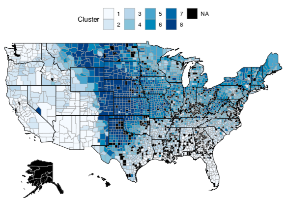

I recently had a conversion with a friend about how Indianapolis has 'weird
weather' where it can be snowing one day and sunny the next. I wondered if this
was true - whether the Midwest has larger differences day-to-day weather
changes compared to other areas of the United States. Instead of guessing, I
decided to perform the analysis!

### Data
I downloaded daily weather data from the [NOAA Climate Data Online dataset repository](https://www.ncdc.noaa.gov/cdo-web/).
The dataset included maximum temperature readings from over 8,000 weather stations across
the United States.

### Analysis
I calculated the average successive variability (ASV) for each weather station in
the dataset. ASV is defined as the average absolute difference between successive
values. In R, this looks like:
```r
asv <- function(x){
  x <- x[!is.na(x)]
  v <- NULL
  for (i in seq(1,length(x)-1)){
    v[i] <- abs(x[i+1] - x[i])
  }
  return(mean(v))
}
```

I then binned the ASV values into 8 categories in order to see which counties
had the highest variability.

The difficulty, however, was converting longtitude and latitude into counties. Luckily
a [StackOverflow thread](https://stackoverflow.com/questions/13316185/r-convert-zipcode-or-lat-long-to-county)
made this an easy task.

```r
library(sp)
library(maps)
library(maptools)
latlong2county <- function(pointsDF) {
  # Prepare SpatialPolygons object with one SpatialPolygon
  # per county
  counties <- map('county', fill=TRUE, col="transparent", plot=FALSE)
  IDs <- sapply(strsplit(counties$names, ":"), function(x) x[1])
  counties_sp <- map2SpatialPolygons(counties, IDs=IDs,proj4string=CRS("+proj=longlat +datum=WGS84"))

  # Convert pointsDF to a SpatialPoints object
  pointsSP <- SpatialPoints(pointsDF, proj4string=CRS("+proj=longlat +datum=WGS84"))

  # Use 'over' to get _indices_ of the Polygons object containing each point
  indices <- over(pointsSP, counties_sp)
  
  # Return the county names of the Polygons object containing each point
  countyNames <- sapply(counties_sp@polygons, function(x) x@ID)
  countyNames[indices]
}
```

### Results
A choreopleth map of the results is below. The region with the most variability
was clearly the Midwest United States. The highest bin had ASV values ranging from 9-17
degrees fahrenheit. In other words, the day-to-day variability was on average 17 degrees!

Overall, this was a fun and quick exercise that showed the Midwest US has the
largest weather variability compared to other regions of the United States.

